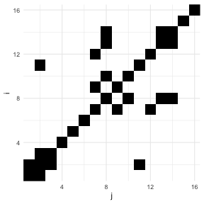
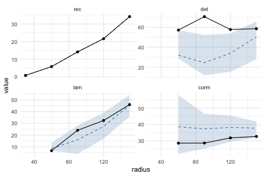

<!-- README.md is generated from README.Rmd. Please edit that file -->


# rqaem

<!-- badges: start -->
[](https://github.com/nccanderson/rqaem/actions/workflows/R-CMD-check.yaml)
[](https://lifecycle.r-lib.org/articles/stages.html#experimental)
[](https://opensource.org/licenses/MIT)
<!-- badges: end -->

`rqaem` is an R port of the eye-movement
recurrence-quantification-analysis method introduced by Anderson,
Bischof, Laidlaw, Risko and Kingstone (2013). It computes the
recurrence matrix and all the scalar metrics described in the paper
(`rec`, `det`, `revdet`, `lam`, `tt`, `corm`, `meanline`, `maxline`,
`ent`, `relent`, `clusters`), and ports the reference Python
implementation at **bit-for-bit parity** on the bundled test
fixtures.

On top of that it adds three things the originals don't have:

- a **tidy data-frame workflow** — `rqa_by()` consumes long-format
  fixation data and returns a one-row-per-group tibble,
- **sparse storage** for long fixation sequences (`Matrix::dgCMatrix`
  from `n = 64` upward), and
- **bootstrap significance testing** and a **radius-sweep helper**
  for choosing a working radius (Fig. 7 of the 2013 paper).

## Installation

```r
# install.packages("devtools")
devtools::install_github("nccanderson/rqaem")
```

## Quick start


``` r
library(rqaem)

# A short scanpath
fix <- rbind(
  c(510, 385), c(466, 429), c(406, 449), c(135, 333),
  c(296, 409), c(117, 398), c(317, 327), c(439, 305),
  c(302, 270), c(444, 347), c(507, 454), c(341, 327),
  c(459, 270), c(493, 293), c(630, 341), c(655, 431)
)

result <- rqa(fix, radius = 64)
result
#> <rqa_result> (rqa)
#>   n = 16, radius = 64, line_length = 2, min_cluster = 8
#>   Metrics:
#>     nrec      9
#>     rec       7.5
#>     det       66.67
#>     revdet    NA
#>     meanline  2
#>     maxline   2
#>     ent       0
#>     relent    NaN
#>     lam       5.882
#>     tt        2
#>     corm      23.7
#>     clusters  0
```

The recurrence matrix is on `result$recmat`. Plot it directly:


``` r
plot_recurrence(result)
```

<div class="figure">

<p class="caption">plot of chunk recurrence-plot</p>
</div>

## Multi-trial workflow

The headline ergonomic win over the originals: feed `rqa_by()` a
long-format data frame and get back one row per trial with all 13
scalar metrics.


``` r
set.seed(1)
eyedat <- data.frame(
  trial = rep(1:4, each = 25),
  x     = runif(100, 0, 1000),
  y     = runif(100, 0, 1000)
)
rqa_by(eyedat, x = x, y = y, by = "trial", radius = 80)
#> # A tibble: 4 x 14
#>   trial     n  nrec   rec   det revdet meanline maxline   ent relent   lam    tt
#>   <int> <int> <int> <dbl> <dbl>  <dbl>    <dbl>   <dbl> <dbl>  <dbl> <dbl> <dbl>
#> 1     1    25     6  2       NA     NA       NA      NA    NA     NA    NA    NA
#> 2     2    25     3  1       NA     NA       NA      NA    NA     NA    NA    NA
#> 3     3    25     8  2.67    NA     NA       NA      NA    NA     NA    NA    NA
#> 4     4    25     5  1.67    NA     NA       NA      NA    NA     NA    NA    NA
#> # i 2 more variables: corm <dbl>, clusters <dbl>
```

## Significance and radius selection

`rqa_bootstrap()` builds a null distribution by resampling. Two null
types: `"shuffle"` (permute fixation order, preserve positions —
breaks temporal structure) and `"uniform"` (draw fresh fixations from
a uniform-on-screen distribution — breaks spatial structure too).


``` r
boot <- rqa_bootstrap(fix, radius = 64, n = 199, seed = 1L)
summary(boot)
#> <rqa_bootstrap> summary (shuffle, n = 199, 95% CI)
#>  metric observed p_value     lo    hi
#>     rec    7.500 1.00000  7.500  7.50
#>     det   66.667 0.02041 22.222 55.56
#>     lam    5.882 1.00000  5.882 17.65
#>      tt    2.000 1.00000  2.000  2.50
#>    corm   23.704 0.95918 21.037 51.85
#>     ent    0.000 1.00000  0.000  0.00
```

`radius_sweep()` runs `rqa()` over a grid of candidate radii and
optionally attaches a bootstrap-baseline ribbon. The companion
`autoplot()` method reproduces the radius-selection plot from the
paper:


``` r
sweep <- radius_sweep(fix, radii = c(30, 60, 90, 120, 150),
                      bootstrap_n = 99L, seed = 1L)
ggplot2::autoplot(sweep)
#> Warning: Removed 3 rows containing missing values or values outside the scale range
#> (`geom_ribbon()`).
#> Warning: Removed 3 rows containing missing values or values outside the scale range
#> (`geom_line()`).
#> Removed 3 rows containing missing values or values outside the scale range
#> (`geom_line()`).
#> Warning: Removed 3 rows containing missing values or values outside the scale range
#> (`geom_point()`).
```

<div class="figure">

<p class="caption">plot of chunk radius-sweep</p>
</div>

## Reference

Anderson, N. C., Bischof, W. F., Laidlaw, K. E. W., Risko, E. F., &
Kingstone, A. (2013). Recurrence quantification analysis of eye
movements. *Behavior Research Methods*, **45**(3), 842-856.
<https://doi.org/10.3758/s13428-012-0299-5>

The reference Python and MATLAB implementations were written by
Walter F. Bischof and are bundled under `rqa_original/` in this
repository's workspace.
